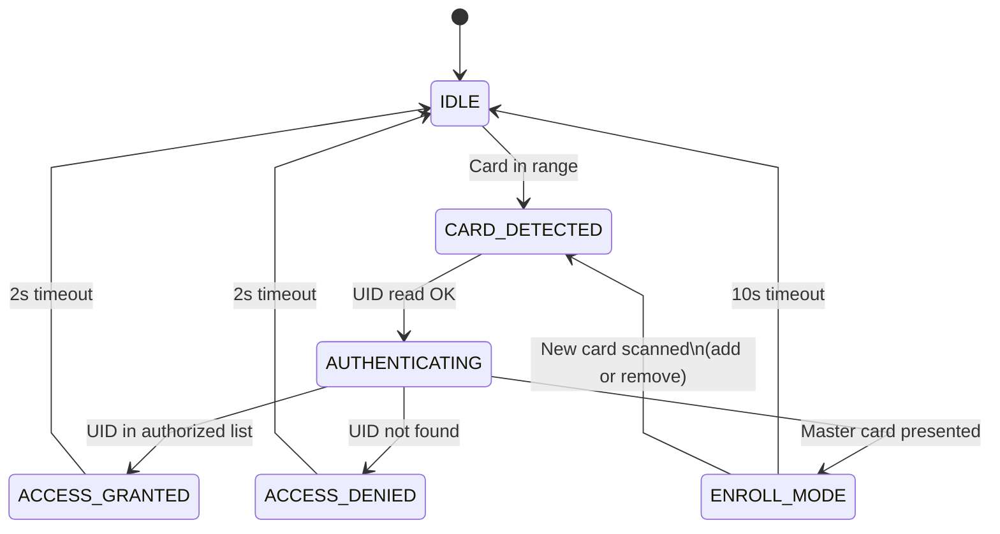

import TawkWidget from '../../../../components/TawkWidget.astro';
import UniversalContentContributors from '../../../../components/UniversalContentContributors.astro';
import InArticleAd from '../../../../components/InArticleAd.astro';
import Copyright from '../../../../components/Copyright.astro';
import BionicText from '../../../../components/BionicText.astro';
import TailwindWrapper from '../../../../components/TailwindWrapper.jsx';
import { Tabs, TabItem } from '@astrojs/starlight/components';
import { Card, CardGrid, Badge, Steps, LinkButton, FileTree } from '@astrojs/starlight/components';

<UniversalContentContributors 
  contributors={frontmatter.contributors}
/>


import SensorActuatorInterfacingStm32Comments from '../../../../components/sensor-actuator-interfacing-stm32/SensorActuatorInterfacingStm32Comments.astro';

A keypad requires users to remember codes, and codes get shared. A fingerprint scanner is expensive and slow. RFID cards are cheap, fast (under 100 ms to authenticate), and each card carries a unique ID that cannot be guessed. That combination of speed, cost, and security is why RFID controls access in offices, transit systems, warehouses, and hotels worldwide. In this lesson you will interface an RC522 13.56 MHz reader over SPI, read and write MIFARE Classic 1K cards, and build a complete door access control system with UID authentication, green/red LED feedback, buzzer tones, OLED status display, and a master card that adds or removes authorized cards without reflashing. #STM32 #RFID #AccessControl

## What We Are Building

<Card title="RFID Door Access Control System" icon="star">
An access control system that continuously scans for RFID cards, reads the UID, checks it against a stored list of authorized cards, and responds with green LED plus short beep (granted) or red LED plus long beep (denied). An SSD1306 OLED displays the scanned UID and access status. The first card registered becomes the master card, which can add or remove other cards from the authorized list.
</Card>

**Project specifications:**

| Parameter | Value |
|-----------|-------|
| Board | Blue Pill (STM32F103C8T6) |
| RFID module | RC522 (MFRC522), SPI interface |
| RFID cards | MIFARE Classic 1K, 13.56 MHz |
| Display | SSD1306 OLED 128x64 (I2C, reused from Lesson 4) |
| SPI bus | SPI1 (PA5 SCK, PA6 MISO, PA7 MOSI) |
| I2C bus | I2C1 (PB6 SCL, PB7 SDA) |
| Max authorized cards | 10 |
| UID length supported | 4-byte and 7-byte |
| Feedback | Green LED, red LED, passive buzzer |

## RFID and NFC Fundamentals

<InArticleAd />


The RC522 operates at 13.56 MHz, which falls in the High Frequency (HF) RFID band. At this frequency, communication happens through electromagnetic induction: the reader's antenna coil generates an alternating magnetic field, and when a card enters the field (typically within 3 to 5 cm), the card's coil picks up enough energy to power the chip and respond.

```text
 RFID Communication (13.56 MHz)
 ┌──────────┐    EM Field    ┌──────────┐
 │  RC522   │   ~3-5 cm     │ MIFARE   │
 │  Reader  │  ┌────────┐   │  Card    │
 │          │  │ Antenna │   │          │
 │  SPI <───┤  │  Coil   │   │ Powered  │
 │  to MCU  │  │ (( (( )) │   │ by field │
 │          │  │         │   │          │
 │  Power:  │  └────────┘   │ 1 KB mem │
 │  3.3V    │               │ UID: 4B  │
 └──────────┘               └──────────┘
  STM32 sends commands       Card responds
  via SPI to RC522           via load modulation
```

**MIFARE Classic 1K memory layout:**

| Structure | Size | Details |
|-----------|------|---------|
| Sectors | 16 | Numbered 0 to 15 |
| Blocks per sector | 4 | Numbered 0 to 3 within each sector |
| Bytes per block | 16 | 16 bytes of data |
| Total memory | 1024 bytes | 16 sectors x 4 blocks x 16 bytes |
| Sector trailer | Block 3 of each sector | Contains Key A (6 bytes), access bits (4 bytes), Key B (6 bytes) |
| Manufacturer block | Sector 0, Block 0 | Contains UID and manufacturer data (read-only) |

The card's UID (Unique Identifier) is stored in block 0 of sector 0. For MIFARE Classic 1K, the UID is typically 4 bytes (sometimes called NUID since it can repeat across manufacturers). Newer MIFARE cards use 7-byte or 10-byte UIDs.

```text
 MIFARE Classic 1K Memory Map
 Sector  Block  Content
 ┌────── ────── ─────────────────────┐
 │  0      0    UID + Manufacturer   │
 │         1    Data (16 bytes)      │
 │         2    Data (16 bytes)      │
 │         3    Key A | Access | Key B│
 ├────── ────── ─────────────────────┤
 │  1      4    Data (16 bytes)      │
 │         5    Data (16 bytes)      │
 │         6    Data (16 bytes)      │
 │         7    Key A | Access | Key B│
 ├────── ────── ─────────────────────┤
 │  ...   ...   (sectors 2-14)       │
 ├────── ────── ─────────────────────┤
 │  15    60    Data (16 bytes)      │
 │        61    Data (16 bytes)      │
 │        62    Data (16 bytes)      │
 │        63    Key A | Access | Key B│
 └────── ────── ─────────────────────┘
  16 sectors x 4 blocks x 16 bytes
  = 1024 bytes total
```

**Default keys:** Factory-fresh MIFARE Classic cards ship with Key A and Key B both set to `0xFF 0xFF 0xFF 0xFF 0xFF 0xFF`. Authentication with either key is required before reading or writing any block in that sector.

:::caution[MIFARE Classic Security]
MIFARE Classic uses a proprietary cipher (Crypto-1) that has been publicly broken since 2008. Do not rely on MIFARE Classic for high-security applications. For production access control, consider MIFARE DESFire EV2/EV3, which uses AES-128 encryption. For this lesson, we use Classic because it is inexpensive, widely available, and sufficient for learning the protocol.
:::

## RC522 Module and SPI Interface

<InArticleAd />


The MFRC522 chip communicates over SPI at up to 10 MHz. The module typically comes on a breakout board with an onboard antenna, voltage regulator, and header pins.

**SPI communication protocol:**

To write a register, send the address byte with bit 7 clear (address shifted left by 1, with bit 0 = 0), followed by the data byte. To read a register, send the address byte with bit 7 set (address shifted left by 1, OR with 0x80, with bit 0 = 0), and the chip returns the register value on the next byte.

**Key MFRC522 registers:**

| Register | Address | Purpose |
|----------|---------|---------|
| CommandReg | 0x01 | Start/stop commands |
| ComIrqReg | 0x04 | Interrupt request bits |
| FIFODataReg | 0x09 | Read/write FIFO buffer |
| FIFOLevelReg | 0x0A | Number of bytes in FIFO |
| BitFramingReg | 0x0D | Bit-oriented framing adjustments |
| ModeReg | 0x11 | General mode settings |
| TxControlReg | 0x14 | Antenna driver control |
| TxASKReg | 0x15 | 100% ASK modulation setting |
| TModeReg | 0x2A | Timer mode settings |
| TPrescalerReg | 0x2B | Timer prescaler |

## Wiring

<InArticleAd />


### RC522 to Blue Pill (SPI1)

| RC522 Pin | Blue Pill Pin | Function |
|-----------|---------------|----------|
| SDA (SS) | PA4 | SPI chip select (active low) |
| SCK | PA5 | SPI clock |
| MOSI | PA7 | Master out, slave in |
| MISO | PA6 | Master in, slave out |
| IRQ | Not connected | Optional interrupt |
| GND | GND | Ground |
| RST | PB0 | Hardware reset (active low) |
| 3.3V | 3.3V | Power supply |

### SSD1306 OLED (I2C1, reused from Lesson 4)

| OLED Pin | Blue Pill Pin | Function |
|----------|---------------|----------|
| SDA | PB7 | I2C data |
| SCL | PB6 | I2C clock |
| VCC | 3.3V | Power |
| GND | GND | Ground |

### Indicators

| Component | Blue Pill Pin | Notes |
|-----------|---------------|-------|
| Green LED (anode) | PB12 | 330 ohm resistor to GND |
| Red LED (anode) | PB13 | 330 ohm resistor to GND |
| Buzzer (+) | PB1 | Passive buzzer, driven by GPIO |
| Buzzer (-) | GND | Ground |

:::tip[RC522 Power]
The RC522 module must run at 3.3V. Do not power it from 5V, even though some breakout boards include a voltage regulator. The SPI lines are not 5V tolerant. The Blue Pill's 3.3V rail can supply the roughly 20 mA the module draws during card communication.
:::

## CubeMX Configuration

<InArticleAd />


<Steps>
1. **Create a new STM32CubeIDE project** for STM32F103C8Tx. Select the Blue Pill board or the chip directly.

2. **SPI1 configuration.** In Connectivity, enable SPI1 as Full-Duplex Master. Set prescaler to 16 (giving 4.5 MHz SPI clock from the 72 MHz APB2). Set CPOL = Low, CPHA = 1 Edge, Data Size = 8 bit, MSB First. Do not enable the hardware NSS pin (we control PA4 manually as GPIO output).

3. **I2C1 configuration.** In Connectivity, enable I2C1 in Standard Mode (100 kHz). PB6 = SCL, PB7 = SDA.

4. **GPIO outputs.** Configure PA4 as GPIO_Output (RC522 chip select), PB0 as GPIO_Output (RC522 reset), PB12 as GPIO_Output (green LED), PB13 as GPIO_Output (red LED), PB1 as GPIO_Output (buzzer).

5. **Clock configuration.** Set HSE to 8 MHz crystal, PLL to 72 MHz SYSCLK. APB1 = 36 MHz, APB2 = 72 MHz.

6. **Generate code** and open the project.
</Steps>

## RC522 Driver Implementation

<InArticleAd />


The driver handles low-level SPI communication, register access, card detection, and MIFARE authentication.

```c title="rc522.h"
#ifndef RC522_H
#define RC522_H

#include "stm32f1xx_hal.h"
#include <stdint.h>

/* MFRC522 Commands */
#define PCD_IDLE              0x00
#define PCD_AUTHENT           0x0E
#define PCD_RECEIVE           0x08
#define PCD_TRANSMIT          0x04
#define PCD_TRANSCEIVE        0x0C
#define PCD_RESETPHASE        0x0F
#define PCD_CALCCRC           0x03

/* MIFARE Commands */
#define PICC_REQIDL           0x26
#define PICC_REQALL           0x52
#define PICC_ANTICOLL1        0x93
#define PICC_ANTICOLL2        0x95
#define PICC_SELECTTAG        0x93
#define PICC_AUTHENT1A        0x60
#define PICC_AUTHENT1B        0x61
#define PICC_READ             0x30
#define PICC_WRITE            0xA0
#define PICC_HALT             0x50

/* MFRC522 Registers */
#define CommandReg            0x01
#define ComIEnReg             0x02
#define DivIEnReg             0x03
#define ComIrqReg             0x04
#define DivIrqReg             0x05
#define ErrorReg              0x06
#define Status1Reg            0x07
#define Status2Reg            0x08
#define FIFODataReg           0x09
#define FIFOLevelReg          0x0A
#define WaterLevelReg         0x0B
#define ControlReg            0x0C
#define BitFramingReg         0x0D
#define CollReg               0x0E
#define ModeReg               0x11
#define TxModeReg             0x12
#define RxModeReg             0x13
#define TxControlReg          0x14
#define TxASKReg              0x15
#define TModeReg              0x2A
#define TPrescalerReg         0x2B
#define TReloadRegH           0x2C
#define TReloadRegL           0x2D
#define AutoTestReg           0x36
#define VersionReg            0x37

/* Status codes */
#define MI_OK                 0
#define MI_NOTAGERR           1
#define MI_ERR                2

/* Card info structure */
typedef struct {
    uint8_t uid[10];
    uint8_t uid_len;
    uint8_t sak;
} RFID_Card_t;

void RC522_Init(SPI_HandleTypeDef *hspi);
void RC522_Reset(void);
void RC522_AntennaOn(void);
void RC522_AntennaOff(void);
uint8_t RC522_Request(uint8_t reqMode, uint8_t *tagType);
uint8_t RC522_Anticoll(uint8_t *serNum);
uint8_t RC522_SelectTag(uint8_t *serNum);
uint8_t RC522_Auth(uint8_t authMode, uint8_t blockAddr, uint8_t *key, uint8_t *serNum);
uint8_t RC522_ReadBlock(uint8_t blockAddr, uint8_t *recvData);
uint8_t RC522_WriteBlock(uint8_t blockAddr, uint8_t *sendData);
void RC522_Halt(void);

#endif
```

```c title="rc522.c"
#include "rc522.h"

static SPI_HandleTypeDef *rc522_spi;

/* Low-level SPI helpers */
static void RC522_CS_Low(void)  { HAL_GPIO_WritePin(GPIOA, GPIO_PIN_4, GPIO_PIN_RESET); }
static void RC522_CS_High(void) { HAL_GPIO_WritePin(GPIOA, GPIO_PIN_4, GPIO_PIN_SET); }
static void RC522_RST_Low(void) { HAL_GPIO_WritePin(GPIOB, GPIO_PIN_0, GPIO_PIN_RESET); }
static void RC522_RST_High(void){ HAL_GPIO_WritePin(GPIOB, GPIO_PIN_0, GPIO_PIN_SET); }

static void RC522_WriteReg(uint8_t addr, uint8_t val)
{
    uint8_t tx[2];
    tx[0] = (addr << 1) & 0x7E;  /* bit 7 = 0 for write */
    tx[1] = val;
    RC522_CS_Low();
    HAL_SPI_Transmit(rc522_spi, tx, 2, 50);
    RC522_CS_High();
}

static uint8_t RC522_ReadReg(uint8_t addr)
{
    uint8_t tx[2], rx[2];
    tx[0] = ((addr << 1) & 0x7E) | 0x80;  /* bit 7 = 1 for read */
    tx[1] = 0x00;
    RC522_CS_Low();
    HAL_SPI_TransmitReceive(rc522_spi, tx, rx, 2, 50);
    RC522_CS_High();
    return rx[1];
}

static void RC522_SetBitMask(uint8_t reg, uint8_t mask)
{
    uint8_t tmp = RC522_ReadReg(reg);
    RC522_WriteReg(reg, tmp | mask);
}

static void RC522_ClearBitMask(uint8_t reg, uint8_t mask)
{
    uint8_t tmp = RC522_ReadReg(reg);
    RC522_WriteReg(reg, tmp & (~mask));
}

void RC522_Init(SPI_HandleTypeDef *hspi)
{
    rc522_spi = hspi;

    RC522_CS_High();
    RC522_RST_High();
    HAL_Delay(50);

    RC522_Reset();

    RC522_WriteReg(TModeReg, 0x8D);       /* Timer auto, prescaler high nibble */
    RC522_WriteReg(TPrescalerReg, 0x3E);   /* Prescaler low byte */
    RC522_WriteReg(TReloadRegL, 30);       /* Timer reload value */
    RC522_WriteReg(TReloadRegH, 0);
    RC522_WriteReg(TxASKReg, 0x40);        /* 100% ASK modulation */
    RC522_WriteReg(ModeReg, 0x3D);         /* CRC preset value 0x6363 */

    RC522_AntennaOn();
}

void RC522_Reset(void)
{
    RC522_WriteReg(CommandReg, PCD_RESETPHASE);
    HAL_Delay(50);
}

void RC522_AntennaOn(void)
{
    uint8_t val = RC522_ReadReg(TxControlReg);
    if (!(val & 0x03)) {
        RC522_SetBitMask(TxControlReg, 0x03);
    }
}

void RC522_AntennaOff(void)
{
    RC522_ClearBitMask(TxControlReg, 0x03);
}

static uint8_t RC522_ToCard(uint8_t command, uint8_t *sendData, uint8_t sendLen,
                            uint8_t *backData, uint16_t *backLen)
{
    uint8_t status = MI_ERR;
    uint8_t irqEn = 0x00, waitIRq = 0x00;
    uint8_t n, lastBits;
    uint16_t i;

    if (command == PCD_AUTHENT) {
        irqEn = 0x12;
        waitIRq = 0x10;
    } else if (command == PCD_TRANSCEIVE) {
        irqEn = 0x77;
        waitIRq = 0x30;
    }

    RC522_WriteReg(ComIEnReg, irqEn | 0x80);
    RC522_ClearBitMask(ComIrqReg, 0x80);
    RC522_SetBitMask(FIFOLevelReg, 0x80);   /* Flush FIFO */
    RC522_WriteReg(CommandReg, PCD_IDLE);

    /* Write data to FIFO */
    for (i = 0; i < sendLen; i++) {
        RC522_WriteReg(FIFODataReg, sendData[i]);
    }

    RC522_WriteReg(CommandReg, command);
    if (command == PCD_TRANSCEIVE) {
        RC522_SetBitMask(BitFramingReg, 0x80);  /* Start send */
    }

    /* Wait for completion */
    i = 2000;
    do {
        n = RC522_ReadReg(ComIrqReg);
        i--;
    } while (i && !(n & 0x01) && !(n & waitIRq));

    RC522_ClearBitMask(BitFramingReg, 0x80);

    if (i != 0) {
        if (!(RC522_ReadReg(ErrorReg) & 0x1B)) {
            status = MI_OK;
            if (command == PCD_TRANSCEIVE) {
                n = RC522_ReadReg(FIFOLevelReg);
                lastBits = RC522_ReadReg(ControlReg) & 0x07;
                if (lastBits) {
                    *backLen = (n - 1) * 8 + lastBits;
                } else {
                    *backLen = n * 8;
                }
                if (n == 0) n = 1;
                if (n > 16) n = 16;
                for (i = 0; i < n; i++) {
                    backData[i] = RC522_ReadReg(FIFODataReg);
                }
            }
        } else {
            status = MI_ERR;
        }
    }
    return status;
}

uint8_t RC522_Request(uint8_t reqMode, uint8_t *tagType)
{
    uint8_t status;
    uint16_t backBits;

    RC522_WriteReg(BitFramingReg, 0x07);  /* 7 bits for short frame */
    tagType[0] = reqMode;
    status = RC522_ToCard(PCD_TRANSCEIVE, tagType, 1, tagType, &backBits);

    if ((status != MI_OK) || (backBits != 0x10)) {
        status = MI_ERR;
    }
    return status;
}

uint8_t RC522_Anticoll(uint8_t *serNum)
{
    uint8_t status;
    uint8_t i, serNumCheck = 0;
    uint16_t unLen;

    RC522_WriteReg(BitFramingReg, 0x00);
    serNum[0] = PICC_ANTICOLL1;
    serNum[1] = 0x20;
    status = RC522_ToCard(PCD_TRANSCEIVE, serNum, 2, serNum, &unLen);

    if (status == MI_OK) {
        for (i = 0; i < 4; i++) {
            serNumCheck ^= serNum[i];
        }
        if (serNumCheck != serNum[4]) {
            status = MI_ERR;
        }
    }
    return status;
}

uint8_t RC522_SelectTag(uint8_t *serNum)
{
    uint8_t i, status;
    uint8_t size;
    uint16_t recvBits;
    uint8_t buffer[9];

    buffer[0] = PICC_SELECTTAG;
    buffer[1] = 0x70;
    for (i = 0; i < 5; i++) {
        buffer[i + 2] = serNum[i];
    }

    /* Calculate CRC for the select command */
    RC522_WriteReg(CommandReg, PCD_IDLE);
    RC522_ClearBitMask(DivIrqReg, 0x04);
    RC522_SetBitMask(FIFOLevelReg, 0x80);
    for (i = 0; i < 7; i++) {
        RC522_WriteReg(FIFODataReg, buffer[i]);
    }
    RC522_WriteReg(CommandReg, PCD_CALCCRC);

    i = 255;
    uint8_t n;
    do {
        n = RC522_ReadReg(DivIrqReg);
        i--;
    } while (i && !(n & 0x04));

    buffer[7] = RC522_ReadReg(0x22);  /* CRC result low */
    buffer[8] = RC522_ReadReg(0x21);  /* CRC result high */

    status = RC522_ToCard(PCD_TRANSCEIVE, buffer, 9, buffer, &recvBits);
    if ((status == MI_OK) && (recvBits == 0x18)) {
        size = buffer[0];
    } else {
        size = 0;
    }
    return size;
}

uint8_t RC522_Auth(uint8_t authMode, uint8_t blockAddr, uint8_t *key, uint8_t *serNum)
{
    uint8_t status;
    uint16_t recvBits;
    uint8_t i, buff[12];

    buff[0] = authMode;
    buff[1] = blockAddr;
    for (i = 0; i < 6; i++) {
        buff[i + 2] = key[i];
    }
    for (i = 0; i < 4; i++) {
        buff[i + 8] = serNum[i];
    }

    status = RC522_ToCard(PCD_AUTHENT, buff, 12, buff, &recvBits);
    if (status != MI_OK) return MI_ERR;
    if (!(RC522_ReadReg(Status2Reg) & 0x08)) return MI_ERR;

    return MI_OK;
}

uint8_t RC522_ReadBlock(uint8_t blockAddr, uint8_t *recvData)
{
    uint8_t status;
    uint16_t unLen;

    recvData[0] = PICC_READ;
    recvData[1] = blockAddr;

    /* CRC calculation */
    RC522_WriteReg(CommandReg, PCD_IDLE);
    RC522_ClearBitMask(DivIrqReg, 0x04);
    RC522_SetBitMask(FIFOLevelReg, 0x80);
    RC522_WriteReg(FIFODataReg, recvData[0]);
    RC522_WriteReg(FIFODataReg, recvData[1]);
    RC522_WriteReg(CommandReg, PCD_CALCCRC);

    uint8_t i = 255, n;
    do { n = RC522_ReadReg(DivIrqReg); i--; } while (i && !(n & 0x04));

    recvData[2] = RC522_ReadReg(0x22);
    recvData[3] = RC522_ReadReg(0x21);

    status = RC522_ToCard(PCD_TRANSCEIVE, recvData, 4, recvData, &unLen);
    if ((status != MI_OK) || (unLen != 0x90)) {
        status = MI_ERR;
    }
    return status;
}

uint8_t RC522_WriteBlock(uint8_t blockAddr, uint8_t *sendData)
{
    uint8_t status;
    uint16_t recvBits;
    uint8_t i, buff[18];

    buff[0] = PICC_WRITE;
    buff[1] = blockAddr;

    /* CRC for write command */
    RC522_WriteReg(CommandReg, PCD_IDLE);
    RC522_ClearBitMask(DivIrqReg, 0x04);
    RC522_SetBitMask(FIFOLevelReg, 0x80);
    RC522_WriteReg(FIFODataReg, buff[0]);
    RC522_WriteReg(FIFODataReg, buff[1]);
    RC522_WriteReg(CommandReg, PCD_CALCCRC);

    i = 255;
    uint8_t n;
    do { n = RC522_ReadReg(DivIrqReg); i--; } while (i && !(n & 0x04));

    buff[2] = RC522_ReadReg(0x22);
    buff[3] = RC522_ReadReg(0x21);

    status = RC522_ToCard(PCD_TRANSCEIVE, buff, 4, buff, &recvBits);
    if ((status != MI_OK) || (recvBits != 4) || ((buff[0] & 0x0F) != 0x0A)) {
        return MI_ERR;
    }

    /* Send 16 bytes of data + CRC */
    for (i = 0; i < 16; i++) {
        buff[i] = sendData[i];
    }

    RC522_WriteReg(CommandReg, PCD_IDLE);
    RC522_ClearBitMask(DivIrqReg, 0x04);
    RC522_SetBitMask(FIFOLevelReg, 0x80);
    for (i = 0; i < 16; i++) {
        RC522_WriteReg(FIFODataReg, buff[i]);
    }
    RC522_WriteReg(CommandReg, PCD_CALCCRC);

    i = 255;
    do { n = RC522_ReadReg(DivIrqReg); i--; } while (i && !(n & 0x04));

    buff[16] = RC522_ReadReg(0x22);
    buff[17] = RC522_ReadReg(0x21);

    status = RC522_ToCard(PCD_TRANSCEIVE, buff, 18, buff, &recvBits);
    if ((status != MI_OK) || (recvBits != 4) || ((buff[0] & 0x0F) != 0x0A)) {
        status = MI_ERR;
    }
    return status;
}

void RC522_Halt(void)
{
    uint16_t unLen;
    uint8_t buff[4];

    buff[0] = PICC_HALT;
    buff[1] = 0;

    RC522_WriteReg(CommandReg, PCD_IDLE);
    RC522_ClearBitMask(DivIrqReg, 0x04);
    RC522_SetBitMask(FIFOLevelReg, 0x80);
    RC522_WriteReg(FIFODataReg, buff[0]);
    RC522_WriteReg(FIFODataReg, buff[1]);
    RC522_WriteReg(CommandReg, PCD_CALCCRC);

    uint8_t i = 255, n;
    do { n = RC522_ReadReg(DivIrqReg); i--; } while (i && !(n & 0x04));

    buff[2] = RC522_ReadReg(0x22);
    buff[3] = RC522_ReadReg(0x21);

    RC522_ToCard(PCD_TRANSCEIVE, buff, 4, buff, &unLen);
}
```

## Card Detection and Anti-Collision

<InArticleAd />


The card detection sequence follows the ISO 14443A protocol:

<Steps>
1. **REQA (Request command A).** The reader broadcasts a 7-bit short frame (0x26). Any card in the field responds with a 2-byte ATQA (Answer To Request A), indicating the card type.

2. **Anti-collision loop.** Multiple cards may respond simultaneously. The anti-collision protocol resolves collisions by progressively narrowing down to a single card's UID. For a single card scenario (most common in access control), one round of anti-collision retrieves the full 4-byte UID plus a BCC (Block Check Character) byte.

3. **SELECT.** The reader sends the UID back to the card with a SELECT command. The card responds with its SAK (Select Acknowledge) byte, confirming selection and indicating whether the UID is complete (for 4-byte UIDs) or whether further anti-collision cascades are needed (for 7-byte or 10-byte UIDs).

4. **Authentication.** Once selected, the reader must authenticate with Key A or Key B for the target sector before any read or write operations. The MFRC522 handles the Crypto-1 mutual authentication internally.
</Steps>

## Access Control State Machine

<InArticleAd />


The system uses five states to manage card scanning and authorization:

| State | Description | Transitions |
|-------|-------------|-------------|
| IDLE | Scanning for cards, OLED shows "Scan Card" | Card detected: go to CARD_DETECTED |
| CARD_DETECTED | UID read successfully | UID valid: go to AUTHENTICATING |
| AUTHENTICATING | Checking UID against authorized list | Match: ACCESS_GRANTED. No match: ACCESS_DENIED |
| ACCESS_GRANTED | Green LED on, short beep, OLED shows "Access Granted" | After 2 seconds: return to IDLE |
| ACCESS_DENIED | Red LED on, long beep, OLED shows "Access Denied" | After 2 seconds: return to IDLE |



**Master card behavior:** The first card ever scanned when the authorized list is empty becomes the master card. When the master card is presented later, the system enters "enroll mode" for 10 seconds. During enroll mode, scanning a new card adds it to the authorized list (if not already present) or removes it (if already present). This toggling lets you manage cards without firmware changes.

## Complete Project Code

<InArticleAd />


```c title="main.c"
/* Includes */
#include "main.h"
#include "rc522.h"
#include <string.h>
#include <stdio.h>

/* --- SSD1306 OLED Driver (simplified, reuse from Lesson 4) --- */
#define SSD1306_ADDR  0x78

static I2C_HandleTypeDef hi2c1;
static SPI_HandleTypeDef hspi1;

/* 5x7 font covering printable ASCII from space (0x20) through 'Z' (0x5A) */
static const uint8_t Font5x7[][5] = {
    {0x00, 0x00, 0x00, 0x00, 0x00}, /* ' ' (space) */
    {0x00, 0x00, 0x5F, 0x00, 0x00}, /* '!' */
    {0x00, 0x07, 0x00, 0x07, 0x00}, /* '"' */
    {0x14, 0x7F, 0x14, 0x7F, 0x14}, /* '#' */
    {0x24, 0x2A, 0x7F, 0x2A, 0x12}, /* '$' */
    {0x23, 0x13, 0x08, 0x64, 0x62}, /* '%' */
    {0x36, 0x49, 0x56, 0x20, 0x50}, /* '&' */
    {0x00, 0x08, 0x07, 0x03, 0x00}, /* '\'' */
    {0x00, 0x1C, 0x22, 0x41, 0x00}, /* '(' */
    {0x00, 0x41, 0x22, 0x1C, 0x00}, /* ')' */
    {0x2A, 0x1C, 0x7F, 0x1C, 0x2A}, /* '*' */
    {0x08, 0x08, 0x3E, 0x08, 0x08}, /* '+' */
    {0x00, 0x80, 0x70, 0x30, 0x00}, /* ',' */
    {0x08, 0x08, 0x08, 0x08, 0x08}, /* '-' */
    {0x00, 0x00, 0x60, 0x60, 0x00}, /* '.' */
    {0x20, 0x10, 0x08, 0x04, 0x02}, /* '/' */
    {0x3E, 0x51, 0x49, 0x45, 0x3E}, /* '0' */
    {0x00, 0x42, 0x7F, 0x40, 0x00}, /* '1' */
    {0x72, 0x49, 0x49, 0x49, 0x46}, /* '2' */
    {0x21, 0x41, 0x49, 0x4D, 0x33}, /* '3' */
    {0x18, 0x14, 0x12, 0x7F, 0x10}, /* '4' */
    {0x27, 0x45, 0x45, 0x45, 0x39}, /* '5' */
    {0x3C, 0x4A, 0x49, 0x49, 0x31}, /* '6' */
    {0x41, 0x21, 0x11, 0x09, 0x07}, /* '7' */
    {0x36, 0x49, 0x49, 0x49, 0x36}, /* '8' */
    {0x46, 0x49, 0x49, 0x29, 0x1E}, /* '9' */
    {0x00, 0x00, 0x14, 0x00, 0x00}, /* ':' */
    {0x00, 0x40, 0x34, 0x00, 0x00}, /* ';' */
    {0x00, 0x08, 0x14, 0x22, 0x41}, /* '<' */
    {0x14, 0x14, 0x14, 0x14, 0x14}, /* '=' */
    {0x00, 0x41, 0x22, 0x14, 0x08}, /* '>' */
    {0x02, 0x01, 0x59, 0x09, 0x06}, /* '?' */
    {0x3E, 0x41, 0x5D, 0x59, 0x4E}, /* '@' */
    {0x7C, 0x12, 0x11, 0x12, 0x7C}, /* 'A' */
    {0x7F, 0x49, 0x49, 0x49, 0x36}, /* 'B' */
    {0x3E, 0x41, 0x41, 0x41, 0x22}, /* 'C' */
    {0x7F, 0x41, 0x41, 0x41, 0x3E}, /* 'D' */
    {0x7F, 0x49, 0x49, 0x49, 0x41}, /* 'E' */
    {0x7F, 0x09, 0x09, 0x09, 0x01}, /* 'F' */
    {0x3E, 0x41, 0x41, 0x51, 0x73}, /* 'G' */
    {0x7F, 0x08, 0x08, 0x08, 0x7F}, /* 'H' */
    {0x00, 0x41, 0x7F, 0x41, 0x00}, /* 'I' */
    {0x20, 0x40, 0x41, 0x3F, 0x01}, /* 'J' */
    {0x7F, 0x08, 0x14, 0x22, 0x41}, /* 'K' */
    {0x7F, 0x40, 0x40, 0x40, 0x40}, /* 'L' */
    {0x7F, 0x02, 0x1C, 0x02, 0x7F}, /* 'M' */
    {0x7F, 0x04, 0x08, 0x10, 0x7F}, /* 'N' */
    {0x3E, 0x41, 0x41, 0x41, 0x3E}, /* 'O' */
    {0x7F, 0x09, 0x09, 0x09, 0x06}, /* 'P' */
    {0x3E, 0x41, 0x51, 0x21, 0x5E}, /* 'Q' */
    {0x7F, 0x09, 0x19, 0x29, 0x46}, /* 'R' */
    {0x26, 0x49, 0x49, 0x49, 0x32}, /* 'S' */
    {0x03, 0x01, 0x7F, 0x01, 0x03}, /* 'T' */
    {0x3F, 0x40, 0x40, 0x40, 0x3F}, /* 'U' */
    {0x1F, 0x20, 0x40, 0x20, 0x1F}, /* 'V' */
    {0x3F, 0x40, 0x38, 0x40, 0x3F}, /* 'W' */
    {0x63, 0x14, 0x08, 0x14, 0x63}, /* 'X' */
    {0x03, 0x04, 0x78, 0x04, 0x03}, /* 'Y' */
    {0x61, 0x59, 0x49, 0x4D, 0x43}, /* 'Z' */
};

static uint8_t oled_buffer[1024]; /* 128x64 / 8 = 1024 bytes */

static void SSD1306_Command(uint8_t cmd)
{
    uint8_t data[2] = {0x00, cmd};
    HAL_I2C_Master_Transmit(&hi2c1, SSD1306_ADDR, data, 2, 50);
}

static void SSD1306_Init(void)
{
    HAL_Delay(100);
    SSD1306_Command(0xAE); /* Display off */
    SSD1306_Command(0xD5); SSD1306_Command(0x80); /* Clock divide */
    SSD1306_Command(0xA8); SSD1306_Command(0x3F); /* Multiplex 64 */
    SSD1306_Command(0xD3); SSD1306_Command(0x00); /* Display offset */
    SSD1306_Command(0x40); /* Start line */
    SSD1306_Command(0x8D); SSD1306_Command(0x14); /* Charge pump on */
    SSD1306_Command(0x20); SSD1306_Command(0x00); /* Horizontal addressing */
    SSD1306_Command(0xA1); /* Segment remap */
    SSD1306_Command(0xC8); /* COM scan direction */
    SSD1306_Command(0xDA); SSD1306_Command(0x12); /* COM pins */
    SSD1306_Command(0x81); SSD1306_Command(0xCF); /* Contrast */
    SSD1306_Command(0xD9); SSD1306_Command(0xF1); /* Pre-charge */
    SSD1306_Command(0xDB); SSD1306_Command(0x40); /* VCOMH deselect */
    SSD1306_Command(0xA4); /* Resume from RAM */
    SSD1306_Command(0xA6); /* Normal display */
    SSD1306_Command(0xAF); /* Display on */
}

static void SSD1306_Clear(void)
{
    memset(oled_buffer, 0, sizeof(oled_buffer));
}

static void SSD1306_Update(void)
{
    SSD1306_Command(0x21); SSD1306_Command(0); SSD1306_Command(127);
    SSD1306_Command(0x22); SSD1306_Command(0); SSD1306_Command(7);

    for (uint16_t i = 0; i < 1024; i += 16) {
        uint8_t buf[17];
        buf[0] = 0x40;
        memcpy(&buf[1], &oled_buffer[i], 16);
        HAL_I2C_Master_Transmit(&hi2c1, SSD1306_ADDR, buf, 17, 50);
    }
}

static void SSD1306_SetPixel(uint8_t x, uint8_t y, uint8_t on)
{
    if (x >= 128 || y >= 64) return;
    if (on) oled_buffer[x + (y / 8) * 128] |=  (1 << (y % 8));
    else    oled_buffer[x + (y / 8) * 128] &= ~(1 << (y % 8));
}

static void SSD1306_DrawChar(uint8_t x, uint8_t y, char c)
{
    if (c < ' ' || c > 'Z') return;

    for (uint8_t col = 0; col < 5; col++) {
        uint8_t line = Font5x7[c - ' '][col];
        for (uint8_t row = 0; row < 7; row++) {
            SSD1306_SetPixel(x + col, y + row, (line >> row) & 1);
        }
    }
}

static void SSD1306_DrawString(uint8_t x, uint8_t y, const char *str)
{
    while (*str) {
        SSD1306_DrawChar(x, y, *str);
        x += 6;
        str++;
    }
}

/* --- Indicator control --- */
static void LED_Green(uint8_t on) {
    HAL_GPIO_WritePin(GPIOB, GPIO_PIN_12, on ? GPIO_PIN_SET : GPIO_PIN_RESET);
}
static void LED_Red(uint8_t on) {
    HAL_GPIO_WritePin(GPIOB, GPIO_PIN_13, on ? GPIO_PIN_SET : GPIO_PIN_RESET);
}
static void Buzzer(uint8_t on) {
    HAL_GPIO_WritePin(GPIOB, GPIO_PIN_1, on ? GPIO_PIN_SET : GPIO_PIN_RESET);
}

static void Beep_Short(void) { Buzzer(1); HAL_Delay(100); Buzzer(0); }
static void Beep_Long(void)  { Buzzer(1); HAL_Delay(500); Buzzer(0); }
static void Beep_Double(void){ Beep_Short(); HAL_Delay(50); Beep_Short(); }

/* --- Access control data --- */
#define MAX_CARDS       10
#define UID_SIZE        4

typedef enum {
    STATE_IDLE,
    STATE_CARD_DETECTED,
    STATE_AUTHENTICATING,
    STATE_ACCESS_GRANTED,
    STATE_ACCESS_DENIED,
    STATE_ENROLL_MODE
} AccessState_t;

static uint8_t master_uid[UID_SIZE];
static uint8_t authorized_uids[MAX_CARDS][UID_SIZE];
static uint8_t num_authorized = 0;
static uint8_t master_registered = 0;
static AccessState_t state = STATE_IDLE;

static uint8_t UID_Match(uint8_t *uid1, uint8_t *uid2)
{
    return (memcmp(uid1, uid2, UID_SIZE) == 0);
}

static int8_t Find_UID(uint8_t *uid)
{
    for (uint8_t i = 0; i < num_authorized; i++) {
        if (UID_Match(uid, authorized_uids[i])) return i;
    }
    return -1;
}

static uint8_t Add_UID(uint8_t *uid)
{
    if (num_authorized >= MAX_CARDS) return 0;
    if (Find_UID(uid) >= 0) return 0;  /* Already exists */
    memcpy(authorized_uids[num_authorized], uid, UID_SIZE);
    num_authorized++;
    return 1;
}

static uint8_t Remove_UID(uint8_t *uid)
{
    int8_t idx = Find_UID(uid);
    if (idx < 0) return 0;
    /* Shift remaining entries down */
    for (uint8_t i = idx; i < num_authorized - 1; i++) {
        memcpy(authorized_uids[i], authorized_uids[i + 1], UID_SIZE);
    }
    num_authorized--;
    return 1;
}

static void UID_ToHexStr(uint8_t *uid, char *str)
{
    const char hex[] = "0123456789ABCDEF";
    for (int i = 0; i < UID_SIZE; i++) {
        str[i * 3]     = hex[(uid[i] >> 4) & 0x0F];
        str[i * 3 + 1] = hex[uid[i] & 0x0F];
        str[i * 3 + 2] = (i < UID_SIZE - 1) ? ' ' : '\0';
    }
    str[UID_SIZE * 3 - 1] = '\0';
}

/* --- Display helpers --- */
static void Display_Idle(void)
{
    SSD1306_Clear();
    /* Row 0: title area (we skip fancy text, just show UID area) */
    /* Row 3: "SCAN CARD" in hex-drawable chars is limited,
       so we draw nothing or a simple indicator */
    SSD1306_Update();
}

static void Display_UID(uint8_t *uid, const char *status_hex)
{
    char hex_str[16];
    SSD1306_Clear();
    UID_ToHexStr(uid, hex_str);
    SSD1306_DrawString(10, 20, hex_str);
    /* Status drawn below */
    if (status_hex) {
        SSD1306_DrawString(10, 40, status_hex);
    }
    SSD1306_Update();
}

/* --- System clock and peripheral init (generated by CubeMX) --- */
static void SystemClock_Config(void)
{
    RCC_OscInitTypeDef RCC_OscInitStruct = {0};
    RCC_ClkInitTypeDef RCC_ClkInitStruct = {0};

    RCC_OscInitStruct.OscillatorType = RCC_OSCILLATORTYPE_HSE;
    RCC_OscInitStruct.HSEState = RCC_HSE_ON;
    RCC_OscInitStruct.HSEPredivValue = RCC_HSE_PREDIV_DIV1;
    RCC_OscInitStruct.PLL.PLLState = RCC_PLL_ON;
    RCC_OscInitStruct.PLL.PLLSource = RCC_PLLSOURCE_HSE;
    RCC_OscInitStruct.PLL.PLLMUL = RCC_PLL_MUL9;
    HAL_RCC_OscConfig(&RCC_OscInitStruct);

    RCC_ClkInitStruct.ClockType = RCC_CLOCKTYPE_HCLK | RCC_CLOCKTYPE_SYSCLK
                                | RCC_CLOCKTYPE_PCLK1 | RCC_CLOCKTYPE_PCLK2;
    RCC_ClkInitStruct.SYSCLKSource = RCC_SYSCLKSOURCE_PLLCLK;
    RCC_ClkInitStruct.AHBCLKDivider = RCC_SYSCLK_DIV1;
    RCC_ClkInitStruct.APB1CLKDivider = RCC_HCLK_DIV2;
    RCC_ClkInitStruct.APB2CLKDivider = RCC_HCLK_DIV1;
    HAL_RCC_ClockConfig(&RCC_ClkInitStruct, FLASH_LATENCY_2);
}

static void MX_GPIO_Init(void)
{
    GPIO_InitTypeDef GPIO_InitStruct = {0};

    __HAL_RCC_GPIOA_CLK_ENABLE();
    __HAL_RCC_GPIOB_CLK_ENABLE();

    /* PA4: RC522 CS (output, high by default) */
    GPIO_InitStruct.Pin = GPIO_PIN_4;
    GPIO_InitStruct.Mode = GPIO_MODE_OUTPUT_PP;
    GPIO_InitStruct.Speed = GPIO_SPEED_FREQ_HIGH;
    HAL_GPIO_Init(GPIOA, &GPIO_InitStruct);
    HAL_GPIO_WritePin(GPIOA, GPIO_PIN_4, GPIO_PIN_SET);

    /* PB0: RC522 RST, PB1: Buzzer, PB12: Green LED, PB13: Red LED */
    GPIO_InitStruct.Pin = GPIO_PIN_0 | GPIO_PIN_1 | GPIO_PIN_12 | GPIO_PIN_13;
    GPIO_InitStruct.Mode = GPIO_MODE_OUTPUT_PP;
    GPIO_InitStruct.Speed = GPIO_SPEED_FREQ_LOW;
    HAL_GPIO_Init(GPIOB, &GPIO_InitStruct);
    HAL_GPIO_WritePin(GPIOB, GPIO_PIN_0, GPIO_PIN_SET);  /* RST high (active) */
    HAL_GPIO_WritePin(GPIOB, GPIO_PIN_1, GPIO_PIN_RESET);
    HAL_GPIO_WritePin(GPIOB, GPIO_PIN_12, GPIO_PIN_RESET);
    HAL_GPIO_WritePin(GPIOB, GPIO_PIN_13, GPIO_PIN_RESET);
}

static void MX_SPI1_Init(void)
{
    __HAL_RCC_SPI1_CLK_ENABLE();

    GPIO_InitTypeDef GPIO_InitStruct = {0};
    /* PA5: SCK, PA7: MOSI (AF push-pull) */
    GPIO_InitStruct.Pin = GPIO_PIN_5 | GPIO_PIN_7;
    GPIO_InitStruct.Mode = GPIO_MODE_AF_PP;
    GPIO_InitStruct.Speed = GPIO_SPEED_FREQ_HIGH;
    HAL_GPIO_Init(GPIOA, &GPIO_InitStruct);

    /* PA6: MISO (input floating) */
    GPIO_InitStruct.Pin = GPIO_PIN_6;
    GPIO_InitStruct.Mode = GPIO_MODE_INPUT;
    GPIO_InitStruct.Pull = GPIO_NOPULL;
    HAL_GPIO_Init(GPIOA, &GPIO_InitStruct);

    hspi1.Instance = SPI1;
    hspi1.Init.Mode = SPI_MODE_MASTER;
    hspi1.Init.Direction = SPI_DIRECTION_2LINES;
    hspi1.Init.DataSize = SPI_DATASIZE_8BIT;
    hspi1.Init.CLKPolarity = SPI_POLARITY_LOW;
    hspi1.Init.CLKPhase = SPI_PHASE_1EDGE;
    hspi1.Init.NSS = SPI_NSS_SOFT;
    hspi1.Init.BaudRatePrescaler = SPI_BAUDRATEPRESCALER_16; /* 72/16 = 4.5 MHz */
    hspi1.Init.FirstBit = SPI_FIRSTBIT_MSB;
    hspi1.Init.CRCCalculation = SPI_CRCCALCULATION_DISABLE;
    HAL_SPI_Init(&hspi1);
}

static void MX_I2C1_Init(void)
{
    __HAL_RCC_I2C1_CLK_ENABLE();

    GPIO_InitTypeDef GPIO_InitStruct = {0};
    /* PB6: SCL, PB7: SDA (AF open-drain) */
    GPIO_InitStruct.Pin = GPIO_PIN_6 | GPIO_PIN_7;
    GPIO_InitStruct.Mode = GPIO_MODE_AF_OD;
    GPIO_InitStruct.Speed = GPIO_SPEED_FREQ_HIGH;
    HAL_GPIO_Init(GPIOB, &GPIO_InitStruct);

    hi2c1.Instance = I2C1;
    hi2c1.Init.ClockSpeed = 400000;
    hi2c1.Init.DutyCycle = I2C_DUTYCYCLE_2;
    hi2c1.Init.OwnAddress1 = 0;
    hi2c1.Init.AddressingMode = I2C_ADDRESSINGMODE_7BIT;
    hi2c1.Init.DualAddressMode = I2C_DUALADDRESS_DISABLE;
    hi2c1.Init.GeneralCallMode = I2C_GENERALCALL_DISABLE;
    hi2c1.Init.NoStretchMode = I2C_NOSTRETCH_DISABLE;
    HAL_I2C_Init(&hi2c1);
}

/* --- Main application --- */
int main(void)
{
    HAL_Init();
    SystemClock_Config();
    MX_GPIO_Init();
    MX_SPI1_Init();
    MX_I2C1_Init();

    SSD1306_Init();
    RC522_Init(&hspi1);

    Display_Idle();

    uint8_t card_uid[5];
    uint8_t tagType[2];
    uint32_t enroll_timeout = 0;
    uint8_t enroll_active = 0;

    while (1)
    {
        switch (state)
        {
        case STATE_IDLE:
            /* Attempt to detect a card */
            if (RC522_Request(PICC_REQIDL, tagType) == MI_OK) {
                state = STATE_CARD_DETECTED;
            }
            HAL_Delay(100);
            break;

        case STATE_CARD_DETECTED:
            /* Run anti-collision to get UID */
            if (RC522_Anticoll(card_uid) == MI_OK) {
                state = STATE_AUTHENTICATING;
            } else {
                state = STATE_IDLE;
            }
            break;

        case STATE_AUTHENTICATING:
            /* First card ever becomes master */
            if (!master_registered) {
                memcpy(master_uid, card_uid, UID_SIZE);
                master_registered = 1;
                Add_UID(card_uid);
                Display_UID(card_uid, "1");  /* "1" = first card */
                Beep_Double();
                LED_Green(1);
                HAL_Delay(1500);
                LED_Green(0);
                RC522_Halt();
                state = STATE_IDLE;
                break;
            }

            /* Check if this is the master card */
            if (UID_Match(card_uid, master_uid)) {
                /* Toggle enroll mode */
                enroll_active = !enroll_active;
                if (enroll_active) {
                    enroll_timeout = HAL_GetTick() + 10000; /* 10 seconds */
                    Beep_Double();
                    Display_UID(card_uid, "E");  /* E = enroll mode */
                } else {
                    Beep_Short();
                    Display_UID(card_uid, "0");  /* 0 = enroll off */
                }
                HAL_Delay(1000);
                RC522_Halt();
                state = STATE_IDLE;
                break;
            }

            /* If in enroll mode, add or remove card */
            if (enroll_active && HAL_GetTick() < enroll_timeout) {
                if (Find_UID(card_uid) >= 0) {
                    Remove_UID(card_uid);
                    Display_UID(card_uid, "D");  /* D = deleted */
                    LED_Red(1);
                    Beep_Long();
                    HAL_Delay(1500);
                    LED_Red(0);
                } else {
                    if (Add_UID(card_uid)) {
                        Display_UID(card_uid, "A");  /* A = added */
                        LED_Green(1);
                        Beep_Double();
                        HAL_Delay(1500);
                        LED_Green(0);
                    } else {
                        Display_UID(card_uid, "F");  /* F = full */
                        Beep_Long();
                        HAL_Delay(1500);
                    }
                }
                RC522_Halt();
                state = STATE_IDLE;
                break;
            }

            /* Normal access check */
            if (Find_UID(card_uid) >= 0) {
                state = STATE_ACCESS_GRANTED;
            } else {
                state = STATE_ACCESS_DENIED;
            }
            break;

        case STATE_ACCESS_GRANTED:
            Display_UID(card_uid, "ACC");
            LED_Green(1);
            Beep_Short();
            HAL_Delay(2000);
            LED_Green(0);
            RC522_Halt();
            state = STATE_IDLE;
            Display_Idle();
            break;

        case STATE_ACCESS_DENIED:
            Display_UID(card_uid, "DEN");
            LED_Red(1);
            Beep_Long();
            HAL_Delay(2000);
            LED_Red(0);
            RC522_Halt();
            state = STATE_IDLE;
            Display_Idle();
            break;

        default:
            state = STATE_IDLE;
            break;
        }

        /* Auto-exit enroll mode after timeout */
        if (enroll_active && HAL_GetTick() >= enroll_timeout) {
            enroll_active = 0;
        }
    }
}

/*
 * NOTE: Do not define SysTick_Handler here. CubeMX already generates one
 * in stm32f1xx_it.c that calls HAL_IncTick(). If you need to add custom
 * tick-based logic, place it inside the existing SysTick_Handler in
 * Core/Src/stm32f1xx_it.c rather than defining a duplicate here.
 */
```

## CubeMX Project Structure

<InArticleAd />


After generating code from CubeMX, your project folder should look like this:

<FileTree>
- RFID_Access_Control/
  - Core/
    - Inc/
      - main.h
      - rc522.h
      - stm32f1xx_hal_conf.h
      - stm32f1xx_it.h
    - Src/
      - main.c
      - rc522.c
      - stm32f1xx_hal_msp.c
      - stm32f1xx_it.c
      - system_stm32f1xx.c
  - Drivers/
    - CMSIS/
    - STM32F1xx_HAL_Driver/
  - RFID_Access_Control.ioc
</FileTree>

## Reading and Writing MIFARE Blocks

<InArticleAd />


Beyond UID-based access, you can store data on the card itself. Each sector (except sector 0) has three data blocks (blocks 0, 1, 2) and one sector trailer (block 3). The sector trailer holds Key A, access bits, and Key B.

**To read a block after authentication:**

The following snippet is not a standalone file. Add this code inside one of the `/* USER CODE BEGIN */` sections in your `main.c` (for example, inside the main loop or a helper function). It assumes you already have `card_uid` populated from a successful `RC522_Anticoll()` call:

```c title="read_example.c"
uint8_t key[6] = {0xFF, 0xFF, 0xFF, 0xFF, 0xFF, 0xFF};  /* Default key */
uint8_t card_uid[4];   /* Filled by RC522_Anticoll() during card detection */
uint8_t block_data[18];  /* 16 bytes data + 2 bytes CRC */
uint8_t block_addr = 4;  /* First block of sector 1 */

/* Authenticate sector 1 with Key A */
if (RC522_Auth(PICC_AUTHENT1A, block_addr, key, card_uid) == MI_OK) {
    /* Read block 4 (sector 1, block 0) */
    if (RC522_ReadBlock(block_addr, block_data) == MI_OK) {
        /* block_data[0..15] contains the 16 bytes */
    }
}
```

**To write data to a block:**

Like the read example above, this is a fragment for your `main.c` USER CODE section. It reuses the same `key` and `card_uid` variables declared in the read example:

```c title="write_example.c"
uint8_t key[6] = {0xFF, 0xFF, 0xFF, 0xFF, 0xFF, 0xFF};  /* Default key */
uint8_t card_uid[4];   /* Filled by RC522_Anticoll() during card detection */
uint8_t write_data[16] = "Access:Employee";  /* 16 bytes of data */
uint8_t block_addr = 5;  /* Sector 1, block 1 */

/* Authenticate first */
if (RC522_Auth(PICC_AUTHENT1A, block_addr, key, card_uid) == MI_OK) {
    if (RC522_WriteBlock(block_addr, write_data) == MI_OK) {
        /* Write successful */
    }
}
```

:::danger[Never Write to Block 3 of Any Sector]
Block 3 of each sector is the sector trailer containing keys and access bits. Writing incorrect values to the sector trailer can permanently lock the sector. If you write wrong access bits, you may lose the ability to authenticate with that sector entirely, and there is no recovery.
:::

## Access Bits and Sector Trailer Structure

<InArticleAd />


The sector trailer (block 3 of each sector) has this 16-byte layout:

| Bytes | Content |
|-------|---------|
| 0 to 5 | Key A (6 bytes, always reads as 0x00 for security) |
| 6 to 9 | Access bits (4 bytes: 3 access bytes + 1 user byte) |
| 10 to 15 | Key B (6 bytes, readable if not used for authentication) |

Access bits control read/write permissions for each block in the sector. The default access bits (0xFF 0x07 0x80 0x69) allow read and write with Key A or Key B on all data blocks.

## Testing the System

<InArticleAd />


<Steps>
1. **Flash the firmware** to the Blue Pill using ST-Link and STM32CubeIDE.

2. **Power up and scan the first card.** This card becomes the master. The green LED blinks and the buzzer gives a double beep. The OLED shows the UID.

3. **Present the master card again** to enter enroll mode. You have 10 seconds to scan additional cards to add them to the authorized list.

4. **Scan a new card during enroll mode.** The green LED lights up with a double beep, confirming the card was added.

5. **Exit enroll mode** by waiting for the timeout or presenting the master card again.

6. **Test access.** Present an authorized card (green LED, short beep, "ACC" on OLED). Present an unknown card (red LED, long beep, "DEN" on OLED).

7. **Remove a card.** Enter enroll mode and scan an already-authorized card. It will be removed from the list (red LED, long beep, "D" indicator).
</Steps>

## Production Notes

<InArticleAd />


**Antenna positioning.** The RC522 module's PCB antenna provides roughly 3 to 5 cm of read range in open air. Mounting behind plastic or wood is fine. Metal surfaces reflect the 13.56 MHz signal and drastically reduce range. Keep the antenna at least 3 cm away from any metal panel.

**Metal interference.** If you mount the reader behind a metal door, you need an antenna extension cable or a remote-mount antenna. Some commercial readers use a ferrite backing layer to isolate the antenna from metal surfaces.

**Security limitations.** MIFARE Classic's Crypto-1 cipher was broken publicly in 2008 (see the "Wirelessly Pickpocketing a MIFARE Classic Card" paper by Garcia et al.). The key recovery attack needs only a few card interactions. For learning and low-security applications (like a workshop door or a tool checkout system), Classic is perfectly adequate. For anything involving money, personal data, or physical security, use MIFARE DESFire EV2/EV3 (AES-128) or MIFARE Plus in security level 3.

**Power consumption.** The RC522 draws about 20 mA during active scanning. If you run the system on battery, enable the RC522's soft power-down mode between scans and wake it periodically (for example, every 500 ms) to check for cards.

**ESD protection.** The antenna is directly exposed to the outside world in a door-mount scenario. Add TVS diodes on the SPI lines and antenna connections if the reader is accessible to the public.

<SensorActuatorInterfacingStm32Comments />


<InArticleAd />
<TawkWidget />
<Copyright />